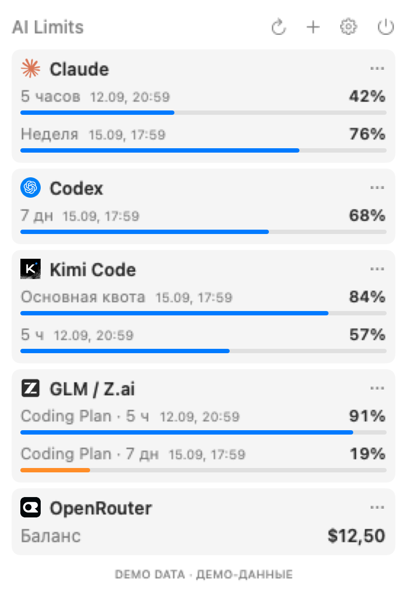
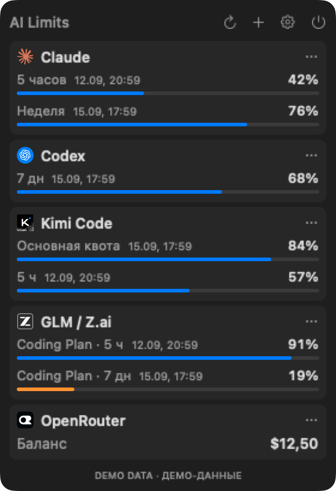

# AI Limits

[English](README.md) | **Русский**

[](https://github.com/igorkomladze-alt/AILimit/actions/workflows/build.yml)
[](LICENSE)


Лимиты **Codex, Claude, Kimi Code, GLM / Z.ai** и баланс **OpenRouter** в строке меню macOS. Каждый пользователь подключает свои аккаунты на своём Mac. Интерфейс приложения — на русском.

**Предварительный выпуск.** Живое чтение Codex, Kimi, GLM и OpenRouter проверено на одном Mac; Claude покрыт тестами, но живая проверка не завершена. API провайдеров могут измениться.

<p align="center">
  
  &nbsp;&nbsp;
  
</p>

*Снимки реального интерфейса с искусственными демоданными. Личные аккаунты и балансы не использовались.*

## Скачать для Mac

**[Скачать AI Limits v0.1.0 — ZIP](https://github.com/igorkomladze-alt/AILimit/releases/download/v0.1.0/AI-Limits-macOS.zip)** · [SHA256](https://github.com/igorkomladze-alt/AILimit/releases/download/v0.1.0/SHA256SUMS.txt) · [Описание выпуска](https://github.com/igorkomladze-alt/AILimit/releases/tag/v0.1.0)

Для готового приложения Xcode и Homebrew не нужны. Требуются **macOS 14+ и Apple Silicon**.

1. Распакуйте ZIP и перенесите **AI Limits.app** в папку **Программы**.
2. Откройте приложение. Если macOS сообщает, что разработчика нельзя проверить, после попытки запуска откройте **Системные настройки → Конфиденциальность и безопасность → Всё равно открыть** — только если доверяете скачанному файлу. [Инструкция Apple](https://support.apple.com/102445).
3. Нажмите значок в строке меню → шестерёнку и подключите свои сервисы.

**Предварительная сборка с ad-hoc подписью, без Developer ID и notarization.** Подпись не является проверкой Apple. Не отключайте Gatekeeper/SIP. Если политика вашего Mac не позволяет запуск, используйте сборку из исходников ниже.

Для проверки ZIP положите его рядом с `SHA256SUMS.txt` и выполните:

```bash
shasum -a 256 -c SHA256SUMS.txt
```

## Возможности

- Компактная панель, отдельные периоды лимитов и дополнительные группы Codex.
- Автообновление, последние снимки при ошибках, светлая и тёмная темы.
- Настраиваемые уведомления и автозапуск — исходно выключены.
- Свои JSON API и готовый шаблон баланса DeepSeek.
- Секреты в Keychain; без генерации запросов к моделям ради статистики.

## Сборка из исходников

Требуются **Apple Silicon (M1+)**, **macOS 14+**, полный **Xcode со Swift 6** и **XcodeGen**. Одних Command Line Tools недостаточно. Локальная проверка проведена на macOS 27 beta / Xcode 27 beta / XcodeGen 2.46; macOS 14 отдельно не проверена. Windows и Linux не поддерживаются.

Для самостоятельной сборки установите и откройте Xcode, завершите первоначальную настройку и выберите его в **Xcode → Settings → Locations → Command Line Tools**. Если Homebrew уже установлен:

```bash
brew install xcodegen
```

Другие способы — в [документации XcodeGen](https://github.com/yonaskolb/XcodeGen#installing). Затем:

```bash
git clone https://github.com/igorkomladze-alt/AILimit.git
cd AILimit
xcodebuild -version
swift --version
xcodegen --version
swift test
bash scripts/package-app.sh
bash scripts/check-bundle.sh
```

Откройте `build` в Finder, перенесите **AI Limits.app** в свою папку **Программы** и запустите. Нажмите значок в строке меню, затем шестерёнку для настройки подключений.

Сборка подписывается локально ad-hoc; Developer ID и notarization отсутствуют. При предупреждении macOS используйте штатное подтверждение открытия доверенного приложения. Не отключайте Gatekeeper/SIP и не удаляйте массово quarantine-атрибуты.

## Подключение сервисов

Можно подключить любое подмножество. Ключи вводятся **только в интерфейсе приложения**, не в исходниках, `.env` или Issues.

| Сервис | Что нужно и как подключить |
|---|---|
| Codex | Подписка ChatGPT с доступом к Codex и [официальный Codex CLI](https://learn.chatgpt.com/docs/cli). Нажмите «Войти через Codex» и завершите вход в браузере. |
| Claude | Claude Code и Claude Pro/Max либо подходящий организационный доступ. Выполните `claude auth login --claudeai`, затем «Разрешить и подключить». Живая проверка ещё не завершена. |
| Kimi Code | Ключ **Kimi Code**, не Moonshot API, либо действующий вход Kimi CLI. Введите ключ или разрешите чтение локального входа. |
| GLM / Z.ai | Ключ международного персонального **Coding Plan**. BigModel CN и API-баланс не поддерживаются. |
| OpenRouter | **Management Key**. GET `/api/v1/credits` читает баланс аккаунта. |

Codex CLI ищется в `/opt/homebrew/bin/codex`, `/usr/local/bin/codex` и `~/.local/bin/codex`; приложение не устанавливает его автоматически. ChatGPT Pro и Claude Pro — отдельные подписки.

Management Key OpenRouter имеет более широкие права, чем чтение баланса; приложение использует только GET статистики. Claude и Kimi CLI читаются после разрешения. Их refresh tokens приложение не обновляет: при истечении входа войдите снова через официальный CLI.

## Свои сервисы и DeepSeek

Нажмите **+** в панели или откройте **Настройки → Свои сервисы**.

**Пример DeepSeek:** выберите **DeepSeek — баланс API**, введите свой API-ключ и нажмите **Проверить и сохранить**. Шаблон задаёт адрес и поля; валюта (`CNY` или `USD`) берётся из ответа. Это денежный API-баланс, а не лимит подписки.

Для **Своего JSON API** задайте название, HTTPS URL статистики и авторизацию: без ключа, Bearer или X-API-Key. Поддерживаются только GET без query-параметров, логина/пароля и фрагмента в URL, перенаправлений и браузерных cookies.

- До **20 сервисов**, до **8 показателей** на каждый: остаток/расход в процентах, деньги или остаток/расход относительно общего лимита.
- Пути: `data.remaining_percent` — вложенное поле; `balance_infos.0.total_balance` — поле первого элемента массива. Числа могут быть числами JSON или строками.
- Валюта: константа либо путь к полю. Время сброса: ISO 8601 или Unix-секунды.
- Сохранение — после успешного GET и проверки полей; при ошибке прежнее подключение остаётся.

Искусственный ответ для настройки процентов:

```json
{"data":{"remaining_percent":72,"resets_at":"2026-10-01T00:00:00Z"}}
```

Ключи хранятся в Keychain, определения и нормализованные значения — локально в `custom-services.json`. При редактировании пустой ключ сохраняет прежний только для прежнего адреса сервера; для нового введите ключ заново.

## Показатели и настройки

- Проценты показывают **остаток**. Ноль отличается от «Нет данных». Периоды 5 часов / 7 дней не суммируются.
- Основной лимит Codex идёт первым; дополнительные группы доступны через «Ещё лимиты». OpenRouter показывает USD.
- При ошибке остаётся последний снимок с предупреждением. Время сброса само по себе не меняет остаток на 100%.
- Обновление каждые 5 минут, максимум три параллельных запроса. Ошибки и Retry-After увеличивают задержку; ручное обновление её не обходит.
- Уведомления: пороги 20% / 5%, OpenRouter строго ниже $3; предупреждения и восстановление настраиваются по сервисам.
- Системная, светлая или тёмная тема, скрытие отключённых сервисов и необязательный автозапуск.

## Приватность и удаление

Ключи — в системном Keychain, namespace `local.gutfresh.AILimits`, без iCloud-синхронизации. Снимки и настройки — в `~/Library/Application Support/AILimits`. Не отправляйте эти личные данные разработчику и не добавляйте в репозиторий.

Codex использует собственный `CODEX_HOME` внутри этого каталога и keyring; вход других приложений не копируется. Браузерные cookies не читаются. Собственного сервера, телеметрии и облачной синхронизации нет; авторизация и статистика обращаются к провайдерам.

Для удаления отключите сервисы и автозапуск, завершите приложение и перенесите его в Корзину. При необходимости вручную удалите `~/Library/Application Support/AILimits`. Не удаляйте `~/.codex`, `~/.claude` или `~/.kimi-code`: они принадлежат другим приложениям.

## Если не работает

| Симптом | Что проверить |
|---|---|
| `xcodebuild requires Xcode` | Выберите полный Xcode в Settings → Locations. |
| `xcodegen: command not found` | Установите XcodeGen и повторите сборку. |
| Codex CLI не найден | `command -v codex` и поддерживаемые пути выше. |
| Claude не подключается | Повторите `claude auth login --claudeai` и разрешите чтение в приложении. |
| 401 / 403 | Подписку, тип ключа; при необходимости войдите заново. |
| 429 | Дождитесь следующей попытки; ручное обновление не обходит задержку. |
| Неверные значения | Сравните с кабинетом провайдера; сообщите сервис, macOS и текст ошибки. |

В Issues скрывайте email, баланс и другие личные данные. Никогда не присылайте ключи, `auth.json` или cookies.

## Известные ограничения

Только macOS / Apple Silicon; интерфейс только на русском. Живой Claude и минимальная версия macOS ещё не проверены. Свои сервисы не поддерживают пороговые уведомления. Сайты без подходящего JSON API и отдельные OAuth-сценарии требуют специальных адаптеров. Изменения API могут нарушить чтение.

## Разработка и лицензия

```bash
swift test
bash scripts/check-privacy.sh
python3 scripts/check-distribution.py
```

CI на macOS проверяет исходники, тесты и упаковку; текущий результат — по значку наверху. Настоящие аккаунты и секреты не нужны. Тесты не доказывают работу живых API. Правила участия — [CONTRIBUTING.md](CONTRIBUTING.ru.md).

Код — [MIT](LICENSE). Логотипы принадлежат владельцам сервисов: [источники и уведомления](THIRD_PARTY_NOTICES.md). Проект не аффилирован с OpenAI, Anthropic, Moonshot, Z.ai или OpenRouter.
